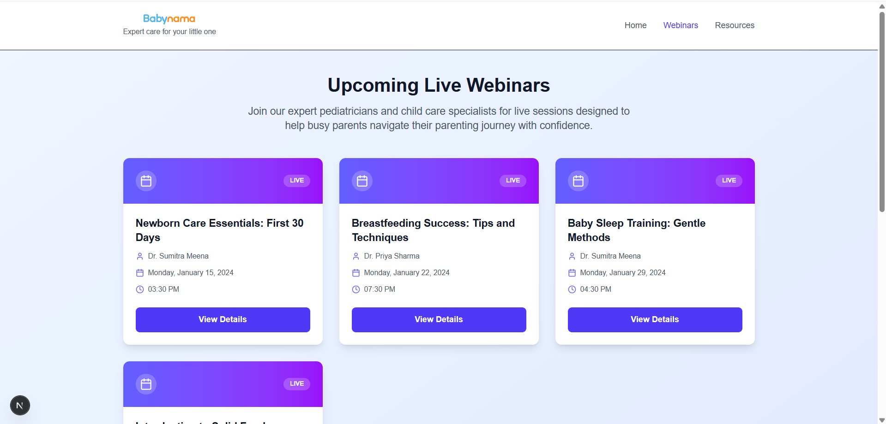

# Babynama Webinars Page

A Next.js application showcasing upcoming live webinars for busy parents, built as part of the Babynama intern assignment.

## 🚀 Live URL

## 📋 Features

- **Webinars Page**: Dedicated `/webinars` route displaying upcoming live sessions
- **Mock Data**: Four sample webinars with realistic information
- **Interactive Cards**: Styled cards with "View Details" functionality
- **Responsive Design**: Mobile-first approach using Tailwind CSS
- **Console Logging**: Click "View Details" to log webinar IDs to browser console

## 🛠️ Technical Choices Made

**Component Separation**: I created a separate `WebinarCard` component because it promotes reusability and keeps the main page component clean. This makes the code more maintainable and follows React best practices for component composition. Each card handles its own styling and click events while receiving data through props.

## 🚧 Roadblock & Learning

**Challenge**: I initially struggled with TypeScript interface definitions for the webinar data and props passing between components.

**Solution**: I had to look up the proper way to define interfaces for React component props, specifically how to type function props like `onViewDetails`. I checked the TypeScript handbook and React documentation to understand how to properly type `(id: number) => void` for the callback function. This helped me ensure type safety throughout the component tree.

## 🎨 Design Highlights

- **Gradient Backgrounds**: Used Tailwind's gradient utilities for visual appeal
- **Card Hover Effects**: Subtle animations and shadow changes on interaction
- **Icon Integration**: Lucide React icons for better visual hierarchy
- **Color Scheme**: Indigo/purple gradient theme matching healthcare aesthetics
- **Typography**: Clear hierarchy with proper font weights and sizes

## 📱 Screenshot

\`\`\`

\`\`\`

## 🏃‍♂️ Getting Started

1. Clone this repository
2. Install dependencies: `npm install`
3. Run development server: `npm run dev`
4. Open [http://localhost:3000](http://localhost:3000) in your browser
5. Navigate to `/webinars` to see the webinars page

## 📦 Built With

- **Next.js** - React framework with App Router
- **TypeScript** - Type safety and better developer experience
- **Tailwind CSS** - Utility-first CSS framework
- **Lucide React** - Beautiful, customizable icons

## 🎯 Assignment Requirements Completed

- ✅ Created `/webinars` route
- ✅ Mock data with 4+ webinar objects (id, title, speaker, date)
- ✅ Styled cards using Tailwind CSS
- ✅ "View Details" button with console logging functionality
- ✅ Responsive design for mobile and desktop
- ✅ Clean, maintainable code structure
